# Building the ETL Pipeline in SSIS (Visual Studio)
### Module: IT3101 – Data Warehousing & Business Intelligence
**Project:** Olist Brazilian E-Commerce Data Warehouse (`Olist_DW`)  
**Pipeline Solution:** `ssis/Olist_ETL/Olist_ETL.sln`  
**Package:** `Package.dtsx`

---

## 1. Prerequisites and Project Setup

Before constructing the pipeline, ensure the **SQL Server Integration Services Projects** extension is installed in Visual Studio.

### 1.1 Project Initialization
1. In Visual Studio, go to **File > New > Project**.
2. Select **Integration Services Project**, name it `Olist_ETL`, and click **Create**.
3. A blank package (`Package.dtsx`) is initialized with **Control Flow** and **Data Flow** designers.

### 1.2 Connection Managers
In the bottom **Connection Managers** area, create three dedicated connections:
* **`Olist_OLTP` (OLE DB Connection):** Points to the source transactional database (`localhost\OlistDW` or operational database).
* **`Olist_DW` (OLE DB Connection):** Points to the target analytical Data Warehouse database (`localhost\OlistDW`).
* **`Products_CSV` (Flat File Connection):** Configured to parse `olist_products_dataset.csv` using UTF-8/ANSI encoding with comma delimiter and column headers in the first data row.

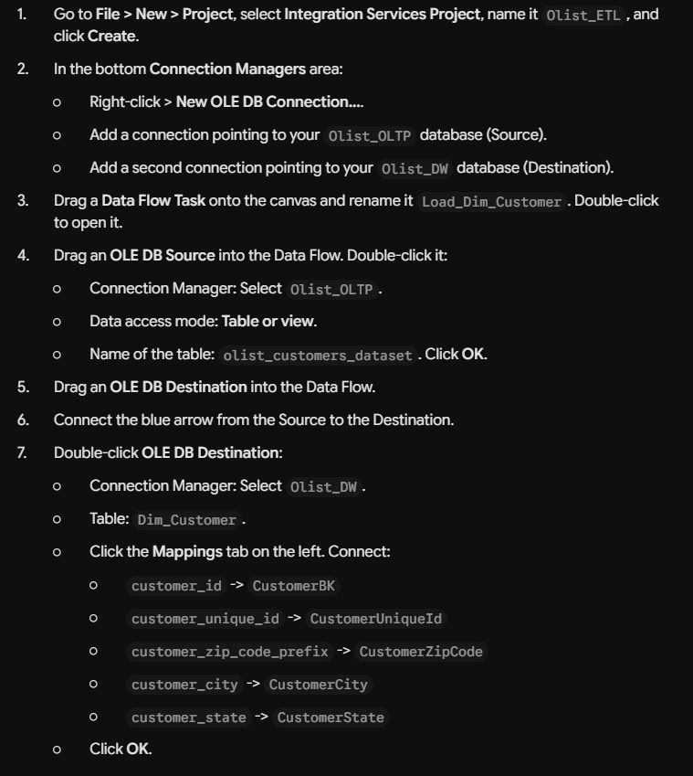

---

## 2. Control Flow Architecture

The Control Flow orchestrates the sequential execution of dimension loading followed by fact table population using **Precedence Constraints** (green success arrows). This enforces referential integrity so that surrogate keys exist in dimensions before fact records are mapped.

```
[ Load_Dim_Customer ]  (Data Flow Task)
        │
        ▼ (Success Precedence Constraint)
[  Load_Dim_Product ]  (Data Flow Task)
        │
        ▼ (Success Precedence Constraint)
[  Load_Fact_Orders ]  (Data Flow Task)
```

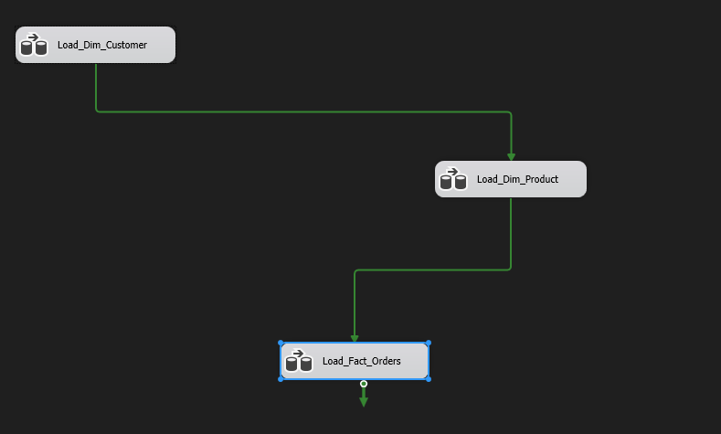

---

## 3. Data Flow 1: Loading `Dim_Customer`

### 3.1 OLE DB Source Configuration
1. Drag a **Data Flow Task** onto the canvas and rename it `Load_Dim_Customer`.
2. Double-click to open its Data Flow designer.
3. Drag an **OLE DB Source** from the SSIS Toolbox (under *Other Sources*).
4. Configure connection:
   * **OLE DB Connection Manager:** `Olist_OLTP`
   * **Data access mode:** `Table or view`
   * **Name of table or view:** `[dbo].[olist_customers_dataset]`

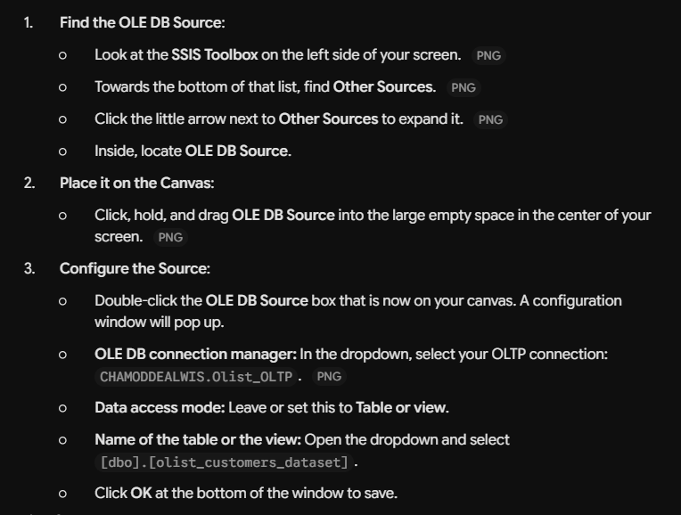

### 3.2 OLE DB Destination & Column Mappings
1. Drag an **OLE DB Destination** below the source and connect the blue data path arrow.
2. Double-click to configure:
   * **Connection Manager:** `Olist_DW`
   * **Data access mode:** `Table or view - fast load`
   * **Table Name:** `[dbo].[Dim_Customer]`
3. In the **Mappings** tab, map the business fields:
   * `customer_id` $\rightarrow$ `CustomerBK`
   * `customer_unique_id` $\rightarrow$ `CustomerUniqueId`
   * `customer_zip_code_prefix` $\rightarrow$ `CustomerZipCode`
   * `customer_city` $\rightarrow$ `CustomerCity`
   * `customer_state` $\rightarrow$ `CustomerState`
   * `CustomerSK` is left **unmapped**, as SQL Server automatically generates the surrogate key via `IDENTITY(1,1)`.

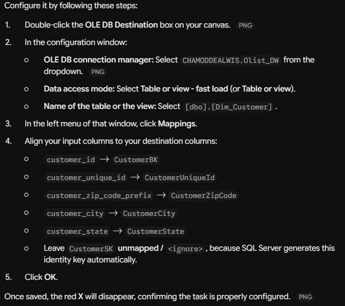

---

## 4. Data Flow 2: Loading `Dim_Product`

### 4.1 Flat File Source Configuration
1. Return to the Control Flow, drag a second Data Flow Task, rename it `Load_Dim_Product`, and link it with a green arrow from `Load_Dim_Customer`.
2. Open `Load_Dim_Product` and add a **Flat File Source** connected to `Products_CSV`.
3. Verify column parsing (delimiters, data types, header rows).

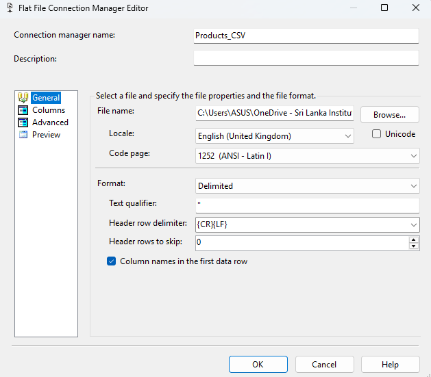

### 4.2 Handling Missing Values with Derived Column
E-commerce catalogs often contain null or unassigned category classifications. To ensure dimensional completeness without dropping rows, a **Derived Column** transformation is introduced:

1. Drag a **Derived Column** transformation below the Flat File Source and connect the blue arrow.
2. In the editor, configure:
   * **Derived Column Name:** `CategoryNameEnglish` (or replace `product_category_name`)
   * **Derived Column:** `Replace 'product_category_name'`
   * **Expression:**
     ```
     REPLACENULL([product_category_name], "Unknown")
     ```
   * This formula guarantees that any missing or blank categories are standardized to `"Unknown"` rather than propagating null values.

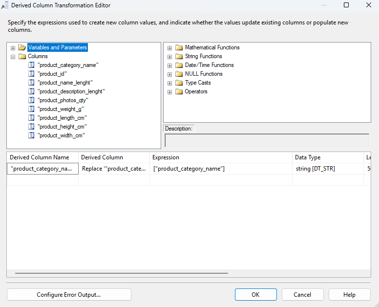

### 4.3 OLE DB Destination & Mappings
1. Add an **OLE DB Destination** connected to `Olist_DW`, table `[dbo].[Dim_Product]`.
2. Set Data access mode to `Table or view - fast load` with `Keep nulls` and `Table lock`.
3. In the **Mappings** tab:
   * `product_id` $\rightarrow$ `ProductBK`
   * `CategoryNameEnglish` $\rightarrow$ `CategoryNameEnglish`
   * `product_weight_g` $\rightarrow$ `ProductWeightGrams`
   * `product_length_cm` $\rightarrow$ `ProductLengthCm`
   * `product_height_cm` $\rightarrow$ `ProductHeightCm`
   * `product_width_cm` $\rightarrow$ `ProductWidthCm`
   * `ProductSK` left unmapped (auto-increment identity).

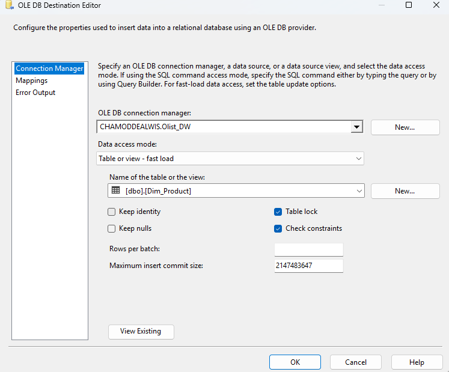
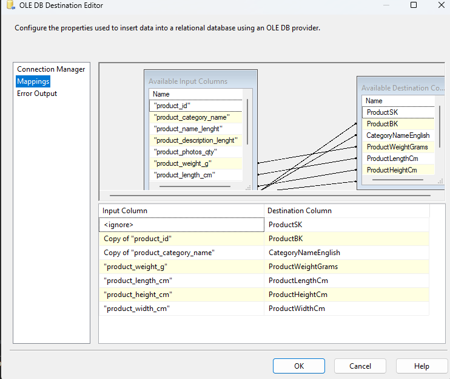

---

## 5. Data Flow 3: Loading Fact Table (`Fact_Orders`)

### 5.1 OLE DB Source (The Extraction SQL Query)
In the Control Flow, add `Load_Fact_Orders` and connect the green arrow from `Load_Dim_Product`.

Double-click to open its canvas and add an **OLE DB Source** with **SQL command**:
```sql
SELECT  
    o.order_id, 
    oi.order_item_id, 
    o.customer_id, 
    oi.product_id, 
    oi.seller_id, 
    CONVERT(INT, CONVERT(VARCHAR(8), o.order_purchase_timestamp, 112)) AS DateKey, 
    oi.price, 
    oi.freight_value, 
    (oi.price + oi.freight_value) AS TotalOrderValue, 
    DATEDIFF(day, o.order_purchase_timestamp, o.order_delivered_customer_date) AS DeliveryTimeDays 
FROM olist_orders_dataset o 
JOIN olist_order_items_dataset oi ON o.order_id = oi.order_id 
WHERE o.order_status = 'delivered'; 
```
* Generates the integer smart date key (`YYYYMMDD`).
* Computes `TotalOrderValue = price + freight_value`.
* Calculates actual customer fulfillment time (`DeliveryTimeDays = DATEDIFF(...)`).
* Filters strictly for fulfilled transactions (`order_status = 'delivered'`).

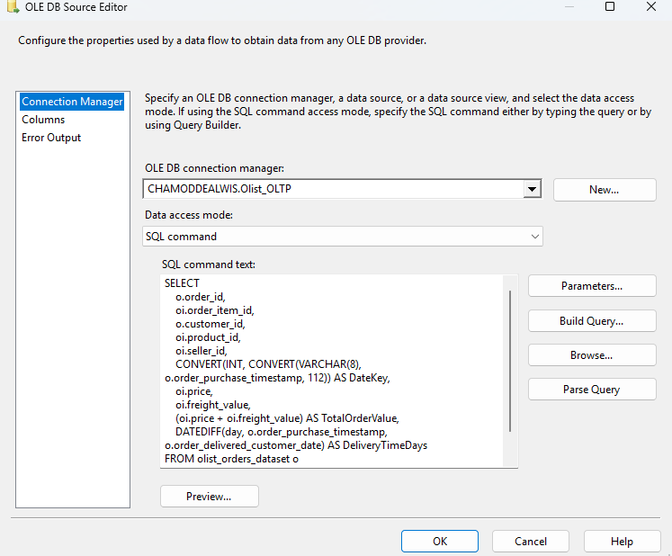

### 5.2 Sequential Lookup Transformations (Surrogate Key Resolution)
To translate natural business keys (`customer_id`, `product_id`, `seller_id`) into integer surrogate keys (`CustomerSK`, `ProductSK`, `SellerSK`), three sequential **Lookup** transformations are chained in the data flow:

1. **Lookup 1: Customer**
   * Connection: `Olist_DW`, table `[dbo].[Dim_Customer]`
   * Join: `customer_id` $\rightarrow$ `CustomerBK`
   * Add Column: `CustomerSK`
2. **Lookup 2: Product**
   * Connection: `Olist_DW`, table `[dbo].[Dim_Product]`
   * Join: `product_id` $\rightarrow$ `ProductBK`
   * Add Column: `ProductSK`
3. **Lookup 3: Seller**
   * Connection: `Olist_DW`, table `[dbo].[Dim_Seller]`
   * Join: `seller_id` $\rightarrow$ `SellerBK`
   * Add Column: `SellerSK`

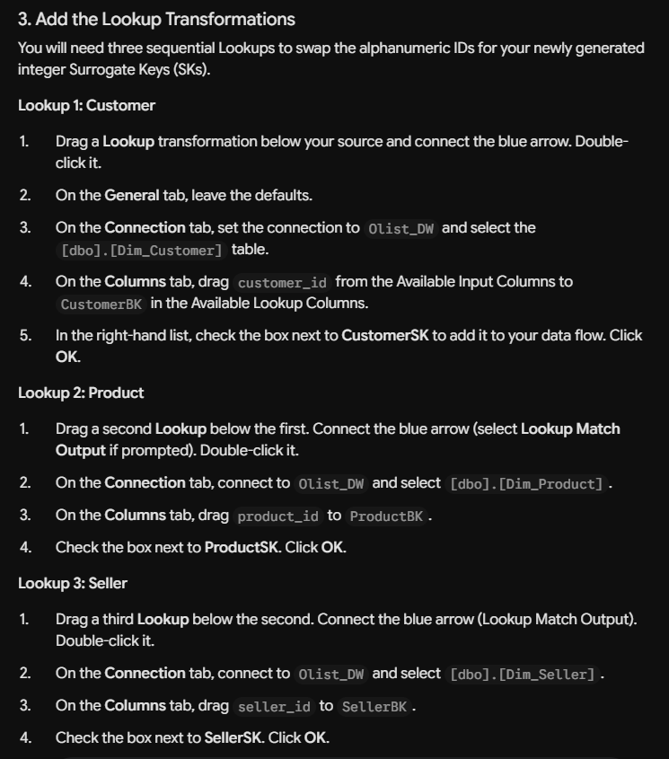
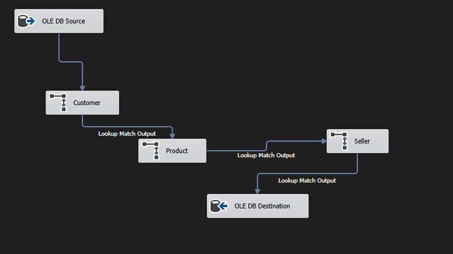

### 5.3 OLE DB Destination (`Fact_Orders`) Mappings
Connect the output of the final Seller Lookup into an **OLE DB Destination** pointing to `[dbo].[Fact_Orders]`:
* `CustomerSK` $\rightarrow$ `CustomerSK`
* `ProductSK` $\rightarrow$ `ProductSK`
* `SellerSK` $\rightarrow$ `SellerSK`
* `DateKey` $\rightarrow$ `DateKey`
* `order_id` $\rightarrow$ `OrderBK`
* `price` $\rightarrow$ `Price`
* `freight_value` $\rightarrow$ `FreightValue`
* `TotalOrderValue` $\rightarrow$ `TotalOrderValue`
* `DeliveryTimeDays` $\rightarrow$ `DeliveryTimeDays`

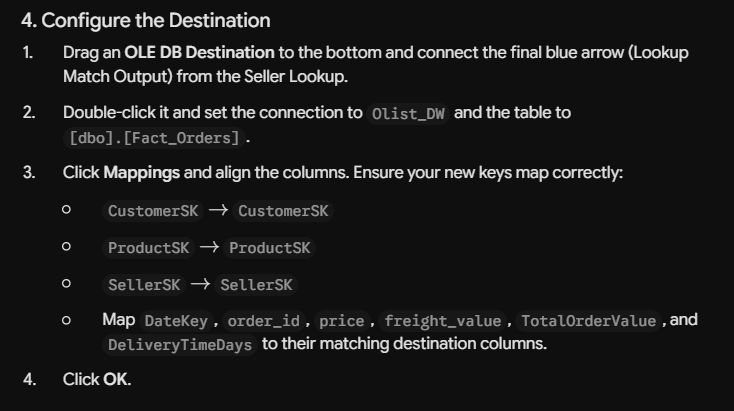

---

## 6. Critical Error Handling in the ETL Pipeline

### 6.1 The Challenge
During initial testing of the Fact table pipeline, the package abruptly crashed with the following error in the execution log:
> **Error:** *The "Seller" component failed because a "Row yielded no match during lookup".*

This occurred because historical operational data contained orphaned records where a `seller_id` in order items had been decommissioned or omitted from the primary sellers extract, causing SSIS's strict default lookup behavior (*Fail component*) to terminate the entire pipeline.

### 6.2 The Solution
1. Double-click the **Seller Lookup** component.
2. On the **General** tab, locate **Specify how to handle rows with no matching entries**.
3. Change the setting from **Fail component** to **Ignore failure** (or redirect rows to error output).
4. This instructs SSIS to assign `NULL` to missing surrogate keys rather than aborting the pipeline, preserving operational throughput while isolating unmapped records for data auditing.

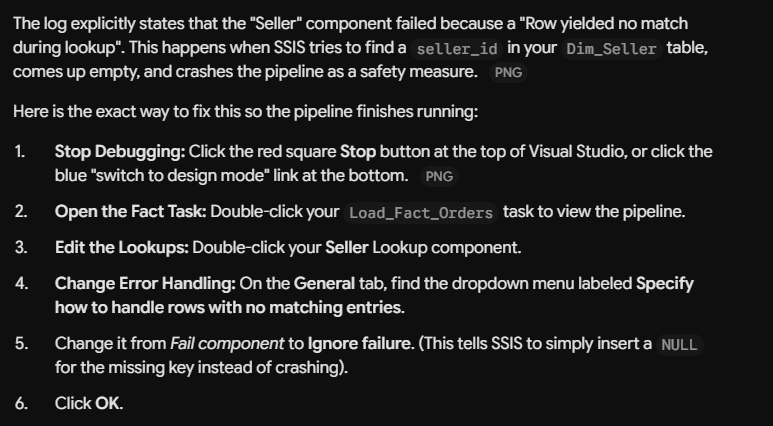

---

## 7. Pipeline Execution and Verification

With all components and error handling configured:
1. Return to the **Control Flow** tab.
2. Press **F5** (or click the green **Start** button in Visual Studio).
3. The package compiles and executes sequentially:
   * `Load_Dim_Customer` $\rightarrow$ ✅ Success (99,441 rows loaded)
   * `Load_Dim_Product` $\rightarrow$ ✅ Success (32,951 rows loaded)
   * `Load_Fact_Orders` $\rightarrow$ ✅ Success (112,650 rows loaded)

All tasks display green checkmarks, confirming the successful population of the data warehouse.

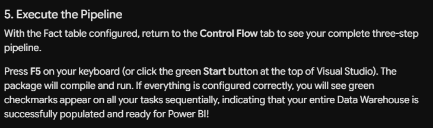

---

## 8. Departmental Data Marts (SQL Views)

To decouple business queries from the underlying star schema and optimize query performance, four specialized Data Marts were deployed into dedicated database schemas:

```
OlistDW
 ├── Logistics
 │    └── ShippingPerformance (View)
 ├── Sales
 │    └── ProductPerformance (View)
 ├── Marketing
 │    └── CustomerInsights (View)
 └── Executive
      └── MonthlySummary (View)
```

### 8.1 Logistics Data Mart: `Logistics.ShippingPerformance`
* **Department:** Logistics & Supply Chain
* **Purpose:** Monitors delivery punctuality, carrier lead times, and freight cost corridors between origin and destination states.
```sql
CREATE VIEW Logistics.ShippingPerformance AS
SELECT
    f.OrderBK,
    d.FullDate AS PurchaseDate,
    c.CustomerCity AS DestinationCity,
    c.CustomerState AS DestinationState,
    s.SellerCity AS OriginCity,
    s.SellerState AS OriginState,
    f.FreightValue,
    f.DeliveryTimeDays
FROM dbo.Fact_Orders f
JOIN dbo.Dim_Date d ON f.DateKey = d.DateKey
JOIN dbo.Dim_Customer c ON f.CustomerSK = c.CustomerSK
JOIN dbo.Dim_Seller s ON f.SellerSK = s.SellerSK;
```
* **Validated Row Count:** 112,650 rows

### 8.2 Sales Data Mart: `Sales.ProductPerformance`
* **Department:** Commercial Sales & Merchandising
* **Purpose:** Analyzes revenue distribution by product category over calendar periods.
```sql
CREATE VIEW Sales.ProductPerformance AS
SELECT
    p.CategoryNameEnglish,
    p.ProductBK AS ProductID,
    d.FullDate AS SaleDate,
    f.Price,
    f.TotalOrderValue
FROM dbo.Fact_Orders f
JOIN dbo.Dim_Product p ON f.ProductSK = p.ProductSK
JOIN dbo.Dim_Date d ON f.DateKey = d.DateKey;
```
* **Validated Row Count:** 112,650 rows

### 8.3 Marketing Data Mart: `Marketing.CustomerInsights`
* **Department:** Marketing & Customer Retention
* **Purpose:** Delivers customer geographic segmentation and seasonal order frequency.
```sql
CREATE VIEW Marketing.CustomerInsights AS
SELECT
    c.CustomerBK AS CustomerID,
    c.CustomerCity,
    c.CustomerState,
    d.Year,
    d.MonthName,
    d.FullDate AS OrderDate,
    f.TotalOrderValue
FROM dbo.Fact_Orders f
JOIN dbo.Dim_Customer c ON f.CustomerSK = c.CustomerSK
JOIN dbo.Dim_Date d ON f.DateKey = d.DateKey;
```
* **Validated Row Count:** 112,650 rows

### 8.4 Executive Data Mart: `Executive.MonthlySummary`
* **Department:** Executive Leadership & Board Reporting
* **Purpose:** High-level executive dashboard aggregating monthly order volume, gross revenue, and freight overhead.
```sql
CREATE VIEW Executive.MonthlySummary AS
SELECT
    d.Year,
    d.Month,
    d.MonthName,
    COUNT(DISTINCT f.OrderBK) AS TotalOrders,
    SUM(f.TotalOrderValue) AS TotalRevenue,
    SUM(f.FreightValue) AS TotalFreightCosts
FROM dbo.Fact_Orders f
JOIN dbo.Dim_Date d ON f.DateKey = d.DateKey
GROUP BY
    d.Year,
    d.Month,
    d.MonthName;
```
* **Validated Row Count:** 24 monthly aggregates across 2016–2018
